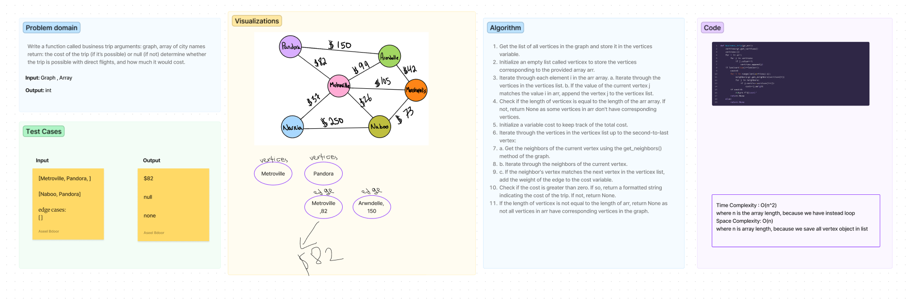

# Graph Business Trip
Write a function called business trip arguments: graph, array of city names return: the cost of the trip (if it’s possible) or null (if not) determine whether the trip is possible with direct flights, and how much it would cost.

## Whiteboard

## Description:
- This function calculates the cost of a business trip through a weighted graph 'gr' based on the provided trip route 'arr'.
- It checks if all vertex values in 'arr' exist in the graph, and if so, it calculates the total cost of the trip
        by summing the weights of the edges between consecutive vertices in the route.
        
- If the cost is greater than zero, the function returns a string with the calculated cost formatted with a dollar sign ($).
- If the trip is not possible due to missing vertices or no edges between consecutive vertices, it returns None.

**Required for .venv** `pip install pytest`

## How to run the code 
`python3 python/graph/graph_business_trip.py`

## Test
`pytest`

[Open the code](./graph_business_trip.py)
