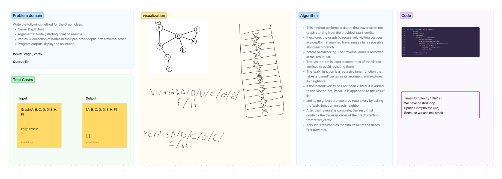

# Graph

**Required for .venv** `pip install pytest`
## Vertix
Is used to represent individual vertices or nodes in a graph. A vertex typically contains a value that represents the data associated with it. The constructor (__init__) takes a single argument value and initializes the vertex's value attribute. The __str__ method is not defined in this version, but it's common to define it to provide a human-readable representation of the vertex when printed.

## Edge
 Is used to represent edges between vertices in a graph. An edge connects two vertices and may have an associated weight, which could represent a distance, cost, or any other relevant value. The constructor (__init__) takes two arguments: vertex, which represents the connected vertex, and weight, which is an optional parameter representing the weight of the edge. The constructor initializes the edge's weight and vertex attributes.

## Graph
  - **add_vertix**
    - Arguments: value
    - Returns: The added vertex
    - Add a vertex to the graph

  - **add_edge**
    - Arguments: 2 vertices
    - Returns: nothing
    - Adds a new edge between two vertices in the graph
    - If specified, assign a weight to the edge
    - Both vertices should already be in the Graph

  - **get_vertices**
    - Arguments: none
    - Returns: all of the vertices in the graph
    - collection (set, list, or similar)
    - Empty collection returned if there are no vertices

  - **get_neighbors**
    - Arguments: vertex
    - Returns: collection of edges connected to the 
      given vertex
    - Include the weight of the connection in the          returned collection
    - Empty collection returned if there are no vertices

  - **breadth_first**
    - Arguments: start_vertex
    - Returns:  A list containing the values of the vertices visited during the traversal in the order they were traversed.

  - **depth_first**
    - Arguments: Node (Starting point of search)
    - Return: A collection of nodes in their pre-order depth-first traversal order
    - Program output: Display the collection
    - Whiteboard 

## How to run the code 
`python3 python/graph/graph.py`

## Test
`pytest`

[Open the code](./graph.py)
