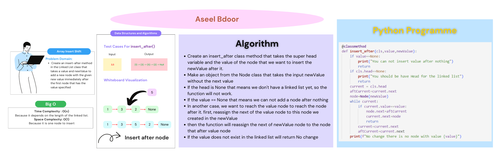

# Singly Linked Lists
## Whitebord
Insert

Append
.png)
Insert Before

Insert After

## Required for .venv
`pip install pytest`
## Node
Create a Node class that has properties for the value stored in the Node, and a pointer to the next Node.
## Linked List
- Create a Linked List class
- Within your Linked List class, include a head property.
  - Upon instantiation, an empty Linked List should be created.
- The class should contain the following methods
  - **insert**
    - Arguments: value
    - Returns: nothing
    - Adds a new node with that value to the head of the list with an O(1) Time performance.
  - **includes**
    - Arguments: value
    - Returns: Boolean
       - Indicates whether that value exists as a Node’s value somewhere within the list.
  - **to string**
    - Arguments: none
    - Returns: a string representing all the values in the Linked List, formatted as: `"{ a } -> { b } -> { c } -> NULL"`
  - **append**
    - arguments: new value
    - adds a new node with the given value to the end of the list
  - **insert before**
    - arguments: value, new value
    - adds a new node with the given new value immediately before the first node that has the value specified
  - **insert after**
    - arguments: value, new value
    - adds a new node with the given new value immediately after the first node that has the value specified

## How to run the code 
`python3 python/linked_list/linked_list.py`

## Test
`pytest`
- **append**

| Initial List | Method Args | Resulting List |
| :---        |    :----:   |    :----:   | 
|head -> {1} -> {3} -> {2} -> X|5|head -> {1} -> {3} -> {2} -> {5} -> X
|head -> X|1|head -> {1} -> X|

- **insert before**

| Initial List | Method Args | Resulting List |
| :---        |    :----:   |    :----:   | 
|head -> {1} -> {3} -> {2} -> X|3,5|head -> {1} -> {5} -> {3} -> {2} -> X
|head -> {1} -> {3} -> {2} -> X|1,5|head -> {5} -> {1} -> {3} -> {2} -> X|
|head -> {1} -> {2} -> {2} -> X|2,5|head -> {1} -> {5} -> {2} -> {2} -> X|
|head -> {1} -> {3} -> {2} -> X|4,5|No change, method exception|

- **insert after**

| Initial List | Method Args | Resulting List |
| :---        |    :----:   |    :----:   | 
|head -> {1} -> {3} -> {2} -> X|3,5|head -> {1} -> {3} -> {5} -> {2} -> X
|head -> {1} -> {3} -> {2} -> X|2,5|head -> {1} -> {3} -> {2} -> {5} -> X|
|head -> {1} -> {2} -> {2} -> X|2,5|hhead -> {1} -> {2} -> {5} -> {2} -> X|
|head -> {1} -> {3} -> {2} -> X|4,5|No change, method exception|

[Open the code](./linked_list.py)
