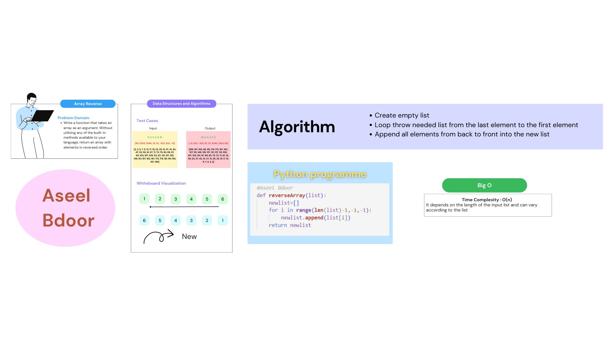

# data-structures-and-algorithms
Write a function that takes an array as an argument. Without utilizing any of the built-in methods available to your language, return an array with elements in reversed order.

## Whiteboard Process

## Approach & Efficiency
 - Create empty list
 - Loop throw needed list from the last element to the first element
 - Append all elements from back to front into the new list

Time Complexity : **O(n)**

Space Complexity : **O(1), constant**

## Example
[1, 2, 3, 4, 5, 6] ==> [6, 5, 4, 3, 2, 1]

[Click here to open the code](./reverse.py)