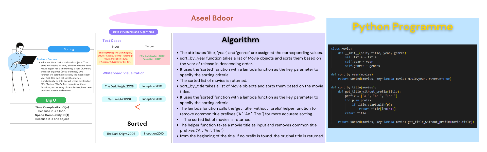

# Insertion Sort
 In the first half of this code challenge, you will write functions which sort domain objects. Your functions will receive an array of Movie objects. Each Movie object has a title (string), a year (number), and a list of genres (array of strings). One function will sort the movies by most recent year first. One function will sort the movies, alphabetical by title, but will ignore any leading “A”s, “An”s, or “The”s. Test outputs for these functions, and an array of sample data, have been provided in test and movies.

In the second half of the code challenge, you will write tests for your comparator functions. This may necessitate refactoring the code you wrote in part one. Your tests will need to call the comparator functions directly, and make assertions about the response values given test inputs.

**Methods:**
- sort_by_year
  - Arguments: movies
  - Sorts a list of movies based on the year of release.
- sort_by_title
  - Arguments: movies
  - Sorts a list of movies based on the movie titles.

## Whiteboard Process

## Approach & Efficiency
- The Movie class represents a movie object and has three attributes: title (the title of the movie), year (the year of release), and genres (a list of genres associated with the movie). The class has an __init__ method that initializes a new instance of the Movie class with the provided title, year, and genres.

- The sort_by_year function takes a list of Movie objects as input and sorts them based on the year of release. It uses the sorted function with a lambda function as the key parameter to specify the sorting criteria. The lambda function extracts the year attribute from each movie object and performs the sorting in descending order. The sorted list of movies is then returned.

- The sort_by_title function takes a list of Movie objects as input and sorts them based on the movie titles. It uses the sorted function with a lambda function as the key parameter to specify the sorting criteria. The lambda function calls the get_title_without_prefix helper function to remove common title prefixes ("A ", "An ", "The ") from the movie titles. This ensures more accurate sorting. The sorted list of movies is then returned.

- The get_title_without_prefix function is a helper function used by sort_by_title to remove common title prefixes from movie titles. It takes a movie title as input and checks if it starts with any of the common prefixes. If a prefix is found, it removes it from the title. If no prefix is found, the original title is returned.

## Solution
To run the code: `python3 python/sorting/Comparisons/sort.py`

**Sort**
|Input|Output|
|:-----|:---|
|[Movie("The Dark Knight", 2008, ["Action", "Crime", "Drama"]),Movie("Inception", 2010, ["Action", "Adventure", "Sci-Fi"]),Movie("The Matrix", 1999, ["Action", "Sci-Fi"]),Movie("A Beautiful Mind", 2001, ["Biography", "Drama"]),Movie("The Avengers", 2012, ["Action", "Adventure", "Sci-Fi"])]|['The Avengers - 2012', 'A Beautiful Mind - 2001', 'The Dark Knight - 2008', 'Inception - 2010', 'The Matrix - 1999']|

[Open the code](./sort.py)