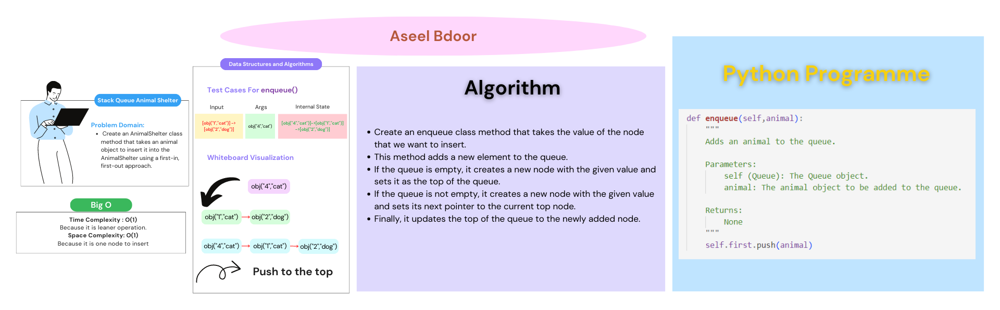
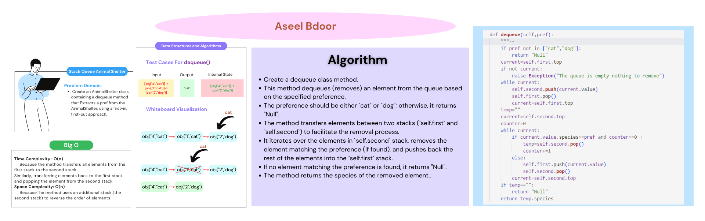

# Stack Queue Animal Shelter
**Create a new class called AnimalShelter**
- holds only dogs and cats.
- The shelter operates using a first-in, first-out approach.

**Methods:**
- enqueue
  - Arguments: animal
  - animal can be either a dog or a cat object.
  - It must have a species property that is either "cat" or "dog".
  - It must have a name property that is a string.

- dequeue
  - Arguments: pref
    - pref can be either "dog" or "cat"
  - Return: either a dog or a cat, based on preference
    - If pref is not "dog" or "cat" then return null.

## Whiteboard Process
enqueue

dequeue

## Approach & Efficiency
**enqueue**
- This method adds a new element to the queue.
- If the queue is empty, it creates a new node with the given value and sets it as the top of the queue.
- If the queue is not empty, it creates a new node with the given value and sets its next pointer to the current top node.
- Finally, it updates the top of the queue to the newly added node.

**dequeue**
- The method checks if the provided pref is either "cat" or "dog". If it is not, it returns "Null" indicating an invalid preference.
- It retrieves the current top node of the self.first stack.
- If the top node is empty, it raises an exception indicating that the queue is empty and there is nothing to remove.
- The method then transfers all the nodes from self.first stack to the self.second stack while emptying self.first.
- It initializes an empty string temp to store the removed element.
- It starts iterating over the nodes in the self.second stack from top to bottom.
- If the current node's species matches the provided preference (pref) and the counter is 0 (indicating it's the first occurrence), it assigns the node's value to temp and increments the counter.
- If the current node's species does not match the preference, it pushes the node's value back to the self.first stack and removes the node from the self.second stack.
- The iteration continues until all the nodes in the self.second stack are processed.
- If temp is still an empty string, it means no element matching the preference was found, so it returns "Null".
- Otherwise, it returns the species of the removed element (temp.species).

## Solution
To run the code: `python3 python/stack_queue_animal_shelter/stack_queue_animal_shelter.py`

**enqueue :**
|Input|Args|Internal State|
|:-----|:---|:----|
|[obj("1","cat")]->[obj("2","dog")]->[obj("3","cat")]|obj("4","cat")|[obj("4","cat")]->[obj("1","cat")]->[obj("2","dog")]->[obj("3","cat")]|
||obj("1","cat")|[obj("1","cat")]|

**dequeue :**
|Input|Args|Output|Internal State|
|:-----|:------|:---|:----|
|[obj("1","cat")]->[obj("2","dog")]->[obj("3","cat")]|"dog"|"dog"|[obj("1","cat")]->[obj("3","cat")]|

[Open the code](./stack_queue_animal_shelter.py)
