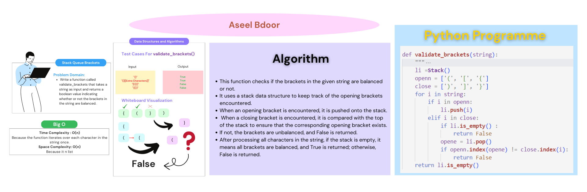

# Stack Queue Brackets
Write a function called validate_brackets that takes a string as input and returns a boolean value indicating whether or not the brackets in the string are balanced. Brackets can be one of three types: (), [], or {}. Your function should check if the opening and closing brackets are properly nested and balanced. Consider all other characters in the string as irrelevant

## Whiteboard Process

## Approach & Efficiency
- The function checks if the brackets in a given string are balanced.
- It takes a string as input and returns a boolean value indicating whether the brackets are balanced or not.
- The function uses a stack to keep track of the opening brackets encountered.
- It defines two lists, openn and close, to store the opening and closing brackets respectively.
- The function iterates over each character in the string.
- If an opening bracket is encountered, it is pushed onto the stack.
- If a closing bracket is encountered, the function checks if the stack is empty. If it is, the brackets are not balanced, and the function returns False.
- If the stack is not empty, the function pops the topmost opening bracket and checks if it matches the current closing bracket. If they don't match, the brackets are not balanced, and the function returns False.
- After processing all characters, the function checks if the stack is empty. If it is, the brackets are balanced, and the function returns True. Otherwise, it returns False.
- The function handles edge cases such as an empty string or a string without any brackets and returns True in such cases.

## Solution
To run the code: `python3 python/stack_queue_brackets/stack_queue_brackets.py`

|Input|Output|
|:-----|:------|
|"{}"|True|
|"{}(){}"|True|
|"()[[Extra Characters]]"|True|
|"(){}[[]]"|True|
|"{}{Code}[Fellows](( ))"|True|
|"[({}]"|False|
|"(]("|False|
|"{(})"|False|

[Open the code](./stack_queue_brackets.py)
