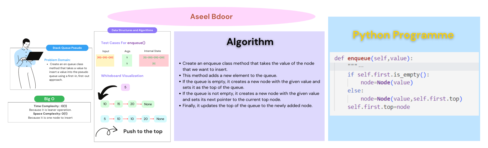
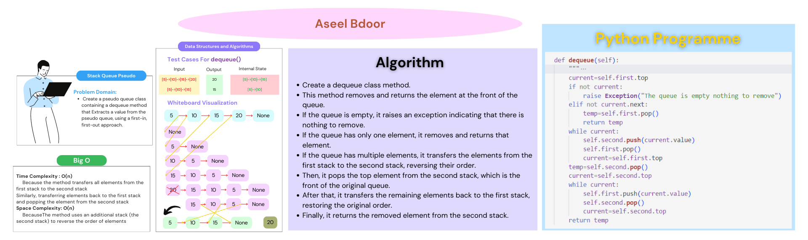

# Stack Queue Pseudo
**Create a new class called pseudo queue.**
- Do not use an existing Queue.
- Instead, this PseudoQueue class will implement our standard queue interface (the two methods listed below),
- Internally, utilize 2 Stack instances to create and manage the queue

**Methods:**
- enqueue
  - Arguments: value
  - Inserts a value into the PseudoQueue, using a first-in, first-out approach.
- dequeue
  - Arguments: none
  - Extracts a value from the PseudoQueue, using a first-in, first-out approach.

## Whiteboard Process
enqueue

dequeue

## Approach & Efficiency
**enqueue**
- This method adds a new element to the queue.
- If the queue is empty, it creates a new node with the given value and sets it as the top of the queue.
- If the queue is not empty, it creates a new node with the given value and sets its next pointer to the current top node.
- Finally, it updates the top of the queue to the newly added node.

**dequeue**
- This method removes and returns the element at the front of the queue.
- If the queue is empty, it raises an exception indicating that there is nothing to remove.
- If the queue has only one element, it removes and returns that element.
- If the queue has multiple elements, it transfers the elements from the first stack to the second stack, reversing their order.
- Then, it pops the top element from the second stack, which is the front of the original queue.
- After that, it transfers the remaining elements back to the first stack, restoring the original order.
- Finally, it returns the removed element from the second stack.

## Solution
To run the code: `python3 python/stack_queue_pseudo/stack_queue_pseudo.py`

**enqueue**
|Input|Args|Internal State|
|:-----|:---|:----|
|[10]->[15]->[20]|5|[5]->[10]->[15]->[20]|
||5|[5]|

**dequeue**
|Input|Output|Internal State|
|:-----|:---|:----|
|[5]->[10]->[15]->[20]|20|[5]->[10]->[15]|
|[5]->[10]->[15]|15|[5]->[10]|

[Open the code](./stack_queue_pseudo.py)