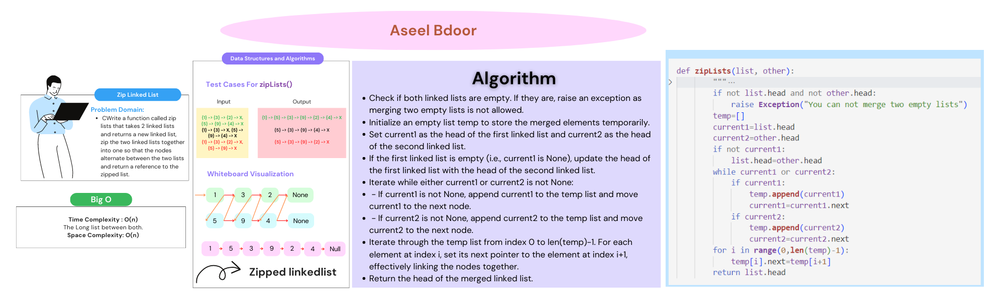

# linked-list-zip
Write a function called zip lists that takes 2 linked lists and return new linked list, zip the two linked lists together into one so that the nodes alternate between the two lists and return a reference to the the zipped list.

## Whiteboard Process
<!-- Embedded whiteboard image -->

## Approach & Efficiency
- Check if both linked lists are empty. If they are, raise an exception as merging two empty lists is not allowed.

- Initialize an empty list temp to store the merged elements temporarily.

- Set current1 as the head of the first linked list and current2 as the head of the second linked list.

- If the first linked list is empty (i.e., current1 is None), update the head of the first linked list with the head of the second linked list.

- Iterate while either current1 or current2 is not None:

  - If current1 is not None, append current1 to the temp list and move current1 to the next node.
  - If current2 is not None, append current2 to the temp list and move current2 to the next node.
- Iterate through the temp list from index 0 to len(temp)-1. For each element at index i, set its next pointer to the element at index i+1, effectively linking the nodes together.
- Return the head of the merged linked list.

Return the head of the merged linked list.

**Time Complexity: O(n)** ....... *(The Long list between both)*

**Space Complexity: O(n)**

## Solution
`python3 python/ziplists/ziplists.py`

|list1|list2|Output|
|:------|:------|:------|
|{1} -> {3} -> {2} -> null |{5} -> {9} -> {4} -> null|{1} -> {5} -> {3} -> {9} -> {2} -> {4} -> null|
|{1} -> {3} -> null|{5} -> {9} -> {4} -> null|{1} -> {5} -> {3} -> {9} -> {4} -> null|
|{1} -> {3} -> {2} -> null|{5} -> {9} -> null|{1} -> {5} -> {3} -> {9} -> {2} -> null|
